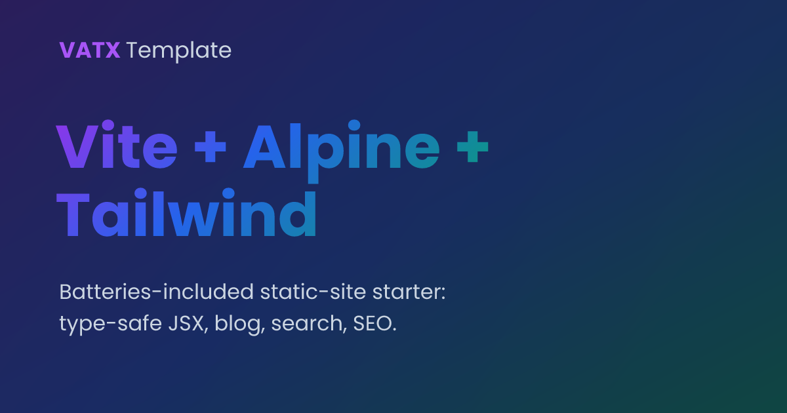

<p align="center">
  
</p>

# ⚡ Vite + 🗻 Alpine + 🎨 Tailwind — Template


🔗 **[Live demo](https://vzsoares.github.io/vite-alpine-tailwind-x/)**

A **static-site starter** that authors its whole UI in **type-safe JSX**,
prerenders it to **static HTML at build time**, and hydrates with **Alpine.js**
— so it's batteries-included (file-based routing 🧭, a Markdown blog 📝,
full-text search 🔍, SEO + social cards 🖼️, dark mode 🌙) yet ships almost no
client JS and deploys free to **GitHub Pages**. 🚀

> Want the **lean, pure client-side** sibling — **plain HTML pages** +
> **pinecone-router** SPA, no prerender? That's
> **[vite-alpine-tailwind](https://github.com/vzsoares/vite-alpine-tailwind)**.
> This repo is the batteries-included, prerendered counterpart.

## ✨ Features

**Stack**

- ⚡️ **Vite** — lightning-fast dev server and builds (Rolldown / oxc)
- 🗻 **Alpine.js** — sprinkle-on client interactivity
- 🔁 **htmx** — bundled & typed, ready for server-driven UI (see [docs/htmx.md](docs/htmx.md))
- 🎨 **Tailwind CSS v4** — utility-first styling (+ `typography` prose + **daisyUI** components)
- ⚛️ **JSX** — type-safe HTML templating via [@kitajs/html](https://github.com/kitajs/html), XSS-scanned
- 📦 **TypeScript** · 🍞 **Bun** · 🧹 **Biome** · 🧪 **Vitest** · 🎭 **Playwright**

**What you get**

- 🏗️ **Static prerendering (SSG)** — JSX → HTML at build; zero UI-framework JS shipped
- 🧭 **File-based routing** — one static file per route, smooth native View Transitions
- 📝 **Markdown blog** — build-time dynamic routes, Shiki highlighting, `prose` styling
- 🔍 **Static search** — full-text search over the built site via [Pagefind](https://pagefind.app)
- 🔎 **SEO baked in** — per-route `<title>`/meta, Open Graph, canonical, `sitemap.xml`, `rss.xml`, `robots.txt`
- 🖼️ **Social cards** — a default `og.png` plus a generated per-post card
- 🌙 **Dark mode** — `data-theme` + `.dark`, remembers your choice
- ♿ **Accessible** — skip link, landmarks, visible focus rings
- 🧨 **404 + 500** prerendered error pages
- 🛡️ **Hardened CI** — lint/type/XSS/unit + e2e (dev **and** production build),
  Dependabot, CodeQL & gitleaks, auto-deploy to GitHub Pages

## 🏁 Quick Start

```bash
# Use this template, then:
bun install
bun run dev        # 👉 http://localhost:5173

bun run build      # build static site into dist/
bun run preview    # preview the production build
```

> First time running e2e tests? Install the browser once:
> `bunx playwright install chromium`

## 🛠️ Post-install checklist

After clicking **"Use this template"** and cloning your new repo, run through these
once before your first commit:

**Identity & metadata (one file does most of it)**

- [ ] **Version** — reset `"version"` in `package.json` to `"0.1.0"`
- [ ] **`package.json`** — update `"name"`, `"description"`, `"author"`,
  `"homepage"`, `"repository.url"`, and `"bugs.url"`
- [ ] **`src/config.ts`** — this is the central identity file; update:
  - `BASE` → `"/<your-repo-name>/"` (Vite base path + canonical prefix)
  - `SITE_URL` → `https://<your-username>.github.io/<your-repo-name>/`
  - `SITE.name`, `.headline`, `.description`, `.keywords`
  - `SITE.author`, `.authorUrl` (used in the footer and RSS feed)
  - `SITE.repoUrl` (used in the nav GitHub link)

**Social image**

- [ ] **`public/og.png`** — replace with your own 1200 × 630 image (used as the
  default OG card; per-post cards are generated from the post title at build time)

**GitHub Pages**

- [ ] **Enable Pages** — go to **Settings → Pages → Source** and select
  **"GitHub Actions"** (the deploy workflow is already wired up)

**Documentation**

- [ ] **Rewrite this README** — replace the template docs with your project's own
  description, features, and instructions

## 📜 Scripts

| Command             | Description                                  |
| ------------------- | -------------------------------------------- |
| `bun run dev`       | Start the Vite dev server with HMR           |
| `bun run build`     | Build into `dist/` + index it for search     |
| `bun run preview`   | Preview the production build locally         |
| `bun run check`     | Lint **and** format the codebase (Biome)     |
| `bun run lint`      | Lint without writing changes (Biome)         |
| `bun run format`    | Format files in place (Biome)                |
| `bun run typecheck` | Type-check with `tsc --noEmit`               |
| `bun run xss-scan`  | Scan JSX for XSS (`@kitajs/ts-html-plugin`)  |
| `bun run test`      | Run unit tests once (Vitest)                 |
| `bun run test:watch`| Run unit tests in watch mode (Vitest)        |
| `bun run test:e2e`  | End-to-end browser tests vs. dev (Playwright)|
| `bun run test:e2e:preview` | E2E vs. the **production build** (preview)   |

## 🗂️ Project Structure

```
/
├── public/         # Static assets copied as-is (favicon.ico, og.png, logos/)
├── src/            # Source files
│   ├── config.ts   # Central site config: identity, links, routes (shared
│   │               # by the build and the components)
│   ├── render.test.ts # Unit tests asserting component HTML output
│   ├── app.ts      # Alpine bootstrap (registers data, starts Alpine)
│   ├── alpine.ts   # Typed Alpine.data() components (e.g. counter)
│   ├── jsx.d.ts    # Opts into @kitajs/html's Alpine.js + x-on:/x-bind: types
│   ├── styles.css  # Tailwind + typography + dark mode + x-cloak + view-transition
│   ├── content/posts.ts # Blog content (Markdown) → one static page per post
│   ├── components/ # Reusable JSX components (build-time HTML)
│   │   ├── layout.tsx # Shared chrome (nav + footer) wrapping each route
│   │   ├── error-page.tsx # Shared status-page layout (404 / 500)
│   │   └── nav.tsx · hero.tsx · features.tsx · demo.tsx · footer.tsx
│   ├── pages/      # One JSX component per route (the ROUTES table in
│   │   │           # config.ts maps each to an output file)
│   │   ├── home.tsx  # "/"  → index.html
│   │   ├── about.tsx # "/about/" → about/index.html
│   │   ├── blog.tsx  # "/blog/" index + post.tsx (per-post template)
│   │   ├── search.tsx # "/search/" (Pagefind, prod build only)
│   │   └── 404.tsx · 500.tsx # status pages → 404.html / 500.html
│   └── lib/        # Framework-agnostic helpers
│       ├── utils.ts
│       ├── utils.test.ts # Example Vitest unit test
│       └── markdown.ts # Markdown → HTML (marked + Shiki, build-time)
├── e2e/            # Playwright end-to-end tests
│   ├── pages.spec.ts    # Every route renders, loads assets, boots Alpine
│   ├── blog.spec.ts     # Dynamic blog routes (index + each post)
│   ├── version.spec.ts  # Footer shows the app version
│   ├── counter.spec.ts  # Typed Alpine counter component
│   ├── routing.spec.ts  # Navigation between the home and about pages
│   └── dark-mode.spec.ts # Theme toggle + persistence
├── e2e-preview/    # E2E against the production build (base path, search, OG)
│   └── build.spec.ts
├── index.html      # The single shell template; every route is stamped from it
├── vite.config.ts  # Vite config (Tailwind, JSX prerender plugin, Vitest)
├── playwright.config.ts # Playwright e2e configuration
├── biome.json      # Biome linter & formatter config
├── tsconfig.json   # TypeScript configuration (incl. JSX + ts-html-plugin)
├── tsconfig.scan.json # Emit-free config for the xss-scan CLI
├── DESIGN.md       # Design system / tokens (for humans + coding agents)
├── AGENTS.md       # Repo guide for AI coding agents (verify, tools, gotchas)
└── docs/htmx.md    # How to use the bundled htmx / go server-side
```

## 🎨 Make it yours

- ✏️ Edit **`src/config.ts`** — site name, description, social links, and `ROUTES`.
- 🎨 Recolor the whole site via the `@theme` **brand tokens** in **`src/styles.css`**.
- 🖼️ Swap the logos in **`public/logos/`** and the **`public/og.png`** social card.
- 📝 Add posts in **`src/content/posts.ts`** (Markdown) — each becomes its own page.
- 🧩 Add pages in **`src/pages/`**, reusable bits in **`src/components/`**.

## ⚛️ JSX

The entire UI is authored as JSX components under `src/components/` and `src/pages/`, powered by
[@kitajs/html](https://github.com/kitajs/html) (full type coverage for every
HTML element/attribute). It's wired via the automatic JSX transform
(`jsxImportSource: "@kitajs/html"`) in `tsconfig.json` and `vite.config.ts`.

### Build-time prerendering

@kitajs/html renders JSX to **HTML strings**, so the app is rendered to static
HTML **at build time** rather than in the browser. The `render-jsx-app` plugin
in `vite.config.ts` renders each route's page component and injects it into the
`<!--app-->` placeholder of its HTML shell; Alpine then hydrates the static
markup at runtime.

- **Dev** loads the JSX through the server's SSR pipeline (`ssrLoadModule`).
- **Build** runs it through Vite's `runnerImport` (Node can't import `.tsx`).

The payoff: the browser receives complete HTML (great for SEO / no flash), and
**@kitajs/html is never shipped to the client** — it only runs during the build.

```tsx
// src/components/demo.tsx — a component returning an HTML string
function Counter(): JSX.Element {
    return (
        <div x-data="counter(0)" class="text-center">
            <p x-text="count">0</p>
            <button type="button" x-on:click="increment()">+</button>
        </div>
    );
}
```

Notes:

- **Directives:** `x-data`, `x-text`, `x-show`, ... are typed by
  `@kitajs/html/alpine`. The namespaced `x-on:click` / `x-bind:class` are made
  typed props by an augmentation in `src/jsx.d.ts`. The `@click` / `:class`
  shorthands stay unsupported (`@` / leading `:` aren't valid JSX prop names);
  the body-level `:class` for dark mode lives in `index.html`, not JSX.
- **XSS:** interpolated variables in children need kitajs's `safe` attribute
  (e.g. `<span safe>{value}</span>`). `bun run xss-scan` enforces this in CI
  (via `tsconfig.scan.json`, whose `noEmit` lets the CLI's validation pass).

## 🧭 Routing

Routing is **static and generated from one template** — every route is stamped
from a single `index.html` shell at build time, so each ends up its own static
HTML file (no client-side router ships to the browser).

- A `ROUTES` table in `src/config.ts` maps each route to a page component and
  output file. At build the `render-jsx-app` plugin reuses the asset-injected
  `index.html` as a template and emits one file per route (`generateBundle`); in
  dev a middleware serves the non-home routes through the same transform.
- **Add a route** with just two edits: create `src/pages/<name>.tsx` (exporting
  `Page`) and add a `ROUTES` entry — no hand-written HTML shell needed.
- Navigation is plain `<a href>`; the `Layout`/`Nav` receive the configured
  `base` so links work under the GitHub Pages subpath.
- Cross-page navigation is smoothed by the native **View Transitions API**
  (`@view-transition { navigation: auto; }` in `styles.css`) — a progressive
  enhancement, ignored by browsers that don't support it.

`src/pages/about.tsx` is a worked example whose Alpine accordion hydrates
after navigation (covered by `e2e/routing.spec.ts`).

### Dynamic routes (build-time)

Routes whose params are known at build time (blog posts, docs, …) are generated
one static file per item. The `/blog/` demo derives its routes from data:

```ts
// src/config.ts
import { posts } from "./content/posts";

export const ROUTES = [
  // ...static routes
  ...posts.map((post) => ({
    out: `blog/${post.slug}/index.html`, // → /blog/<slug>/
    page: "post",                        // one shared component
    title: `${post.title} · ${SITE.name}`,
    description: post.excerpt,
    data: post,                          // payload passed to <Page>
  })),
];
```

The plugin renders `Page({ version, base, data })` for each route, so
`src/pages/post.tsx` is a template reused for every post. Post bodies are
**Markdown** (rendered at build with `marked`, styled by
`@tailwindcss/typography`'s `prose`). Add a post by adding an entry to
`src/content/posts.ts` — it gets its own prerendered page, sitemap + RSS entry,
and `<head>` metadata automatically (see `e2e/blog.spec.ts`). Post bodies are
rendered with **Shiki** syntax highlighting (`src/lib/markdown.ts`, sync core),
and each post gets prev/next navigation.
For params known only at runtime (infinite/user-specific), prerender one shell
page and let an Alpine component read the param and `fetch()` the data instead.

## 🔎 SEO & metadata

Each route carries its own `<head>`. The `ROUTES` table (`src/config.ts`) holds
a `title` + `description` per route; the plugin stamps in `<title>`,
`description`, canonical, Open Graph, and Twitter Card tags via the `<!--head-->`
placeholder. Status pages set `robots: "noindex"`.

- **Social cards:** `public/og.png` (1200×630, project gradient) is the default
  `og:image`; each blog post also gets a **generated** card with its title
  (`@resvg/resvg-js` at build, uses system fonts).
- **`sitemap.xml`, `robots.txt`, and `rss.xml`** are generated at build (RSS
  from the blog posts; noindex routes are excluded from the sitemap).
- **`SITE_URL`** in `src/config.ts` is the absolute origin used for canonical /
  OG / sitemap URLs — update it (and `base`) when you deploy to your own
  domain/repo. (On GitHub *project* pages, `robots.txt` lives under the subpath
  and isn't read at the domain root; submit the sitemap manually if needed.)

Accessibility: a skip-to-content link and a `<main>` landmark wrap each page, and
a global `:focus-visible` ring (`styles.css`) keeps keyboard focus visible.

## 🔍 Search

The `/search/` route uses [Pagefind](https://pagefind.app), which indexes the
built site in a post-build step (`pagefind --site dist`, part of `bun run
build`). The search UI therefore only works in the **production build** (`bun
run build && bun run preview`) — in dev, `/search/` shows a hint instead.

## 🎨 UI components (daisyUI)

[daisyUI](https://daisyui.com) is enabled as a Tailwind plugin (`@plugin
"daisyui"` in `styles.css`). Themes switch via `data-theme` on `<body>` (wired
to the dark-mode toggle), and its `primary` is mapped to the brand color, so
`btn-primary` matches the gradient. The counter in `demo.tsx` is built with
daisyUI's `card` / `btn`; the rest of the UI stays hand-rolled Tailwind.

## 🚀 Deploy

Pushing to `main` runs the checks and deploys `dist/` to **GitHub Pages** via
`.github/workflows/deploy.yml`. Deploying somewhere else? Update `base` and
`SITE_URL` in `src/config.ts` first.

## 📚 Docs

- 🎨 **[DESIGN.md](DESIGN.md)** — design tokens & visual system
- 🤖 **[AGENTS.md](AGENTS.md)** — guide for AI coding agents (verify, tools, gotchas)
- 🔁 **[docs/htmx.md](docs/htmx.md)** — using the bundled htmx / going server-side

## 📄 License

[MIT License](LICENSE)

---

Created by [vzsoares](https://github.com/vzsoares) 💜
